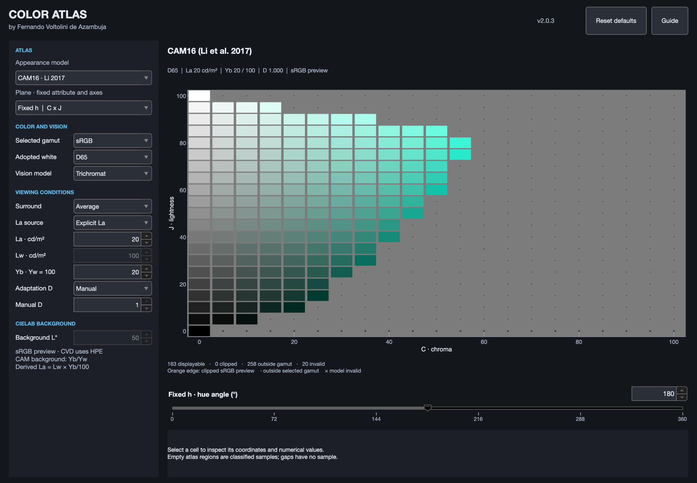

# Color Atlas

An interactive MATLAB app for exploring how color models organize hue,
lightness and chroma. Browse a grid of calculated colors, change the viewing
conditions, and inspect the numbers behind any tile. It is intended for
learning, teaching and investigating color-model behavior.

[Color Atlas: Exploring Color Appearance](https://ferazambuja.github.io/imaging/color-atlas/) explains the project with annotated examples.

Color Atlas began as a graduate coursework project in 2024 with my classmates
Nima Rabbanifar and Soroush Shahbaznejad. For version 2, I fixed a few issues
and made improvements to the app. See [Credits](CREDITS.md) for implementation
and scientific sources.



*Each tile is one calculated color. This CAM16 view holds hue at 180° while
varying chroma C horizontally and lightness J vertically.*

## Requirements

- MATLAB R2026a with Image Processing Toolbox.
- Tested on macOS with R2026a Update 5. Other configurations have not been tested.

The app runs from MATLAB source. Python is needed only for the reference tests.

## Getting started

Clone the repository, then open the project folder in MATLAB:

```sh
git clone https://github.com/ferazambuja/color-atlas.git
cd color-atlas
```

In MATLAB, run:

```matlab
atlas = launch_color_atlas;
```

To launch from another folder, first add the project root to the MATLAB path.
The launcher finds its own resources without changing your working directory.

## Explore a color plane

A color atlas arranges colors by their attributes. This app shows a
**two-dimensional slice**: one attribute stays fixed while the two axes vary.
Hue describes the color family; lightness describes how light or dark a color
appears relative to white; chroma describes color strength relative to a
similarly illuminated white.

Try this sequence:

1. Select **CAM16** and **Fixed h | C x J**. Set the fixed hue to **180**.
2. Read across the plane for increasing chroma and upward for increasing
   lightness. Move the hue slider to browse another slice.
3. Click a tile to inspect its coordinates, XYZ tristimulus values and RGB
   values in the selected space.
4. Change one viewing condition, such as adapting luminance, while keeping the
   others fixed. The app recalculates the colors for that condition.

The **Guide** explains the controls and units. **Reset defaults** restores
CIECAM02, D65, sRGB and trichromat vision. The numeric field supports precise
entry; the slider supports browsing.

### Viewing conditions

A color-appearance model predicts attributes such as lightness and chroma
from XYZ color values and an assumed viewing environment. The atlas runs the
model **in reverse**, calculating the XYZ values needed for each requested
attribute combination. Changing the viewing conditions therefore changes the
calculated colors while the requested appearance coordinates stay fixed.
Brightness Q planes also rescale their sampled range to the adopted white.

The sidebar controls the adopted white, background, surround, adapting
luminance La and adaptation degree D. La can be entered directly in cd/m² or
derived from white luminance Lw and relative background Yb. D can be automatic
or a manual value from 0 to 1. CIELAB uses its reference white and a separate
background-lightness control.

### Gamut and screen preview

An RGB space's **gamut** is the range of colors it can represent. The gamut
selector chooses sRGB, Adobe RGB (1998), ProPhoto RGB or linear sRGB for the
membership test and numerical readout. The visible preview always uses sRGB.

| Tile marking | Meaning |
|---|---|
| Color with no orange outline | Inside the selected gamut and sRGB |
| Orange outline | Inside the selected gamut but clipped for the sRGB preview |
| Dot | Outside the selected gamut; no color tile is drawn |
| Cross | No valid model result for the requested coordinates |

The gaps between tiles contain no samples. Selecting a wider gamut can reveal
additional coordinates, but an sRGB preview cannot reproduce those extra
colors accurately. The app calculates previews; it does not calibrate your
monitor.

## Models

| Model | Coordinates and formulation |
|---|---|
| CIELAB | Lightness L*, chroma C*ab and hue h |
| CIECAM02 | CIE 159:2004 |
| CAM16 | Li et al. 2017 |
| Hellwig 2022 | Modified appearance correlates on the CAM16 basis |
| Hellwig / CAT02 | Composition of Hellwig correlates with CAT02/HPE |

Appearance-model planes use lightness J or brightness Q, chroma C,
colorfulness M or saturation s, and hue h. The interface offers 39 model/plane
combinations. Numeric scales differ between formulations; equal steps do not
guarantee equal perceived differences.

CAM16 here means the 2017 formulation, which differs near black from CIECAM16
in CIE 248:2022. Preview conversion uses full Bradford white adaptation,
separate from the model's adaptation degree D. Q-white defines the exploration
range, not a universal brightness maximum.

Optional protan, deutan and tritan views apply Brettel-style two-wing
projections in the HPE cone basis, using the selected white as neutral. Axes
and requested appearance coordinates stay at their pre-projection values;
XYZ/RGB readouts and gamut classifications describe the projected colors. These
are exploratory approximations; numerical tests do not establish the
experience of an individual observer. The Guide and [Credits](CREDITS.md)
identify the formulations and their sources.

## Numerical API

The calculation class can be used without opening a window:

```matlab
addpath('app')
w = 100 * whitepoint('d65');
[XYZ, status] = ColorAtlasScience.inverseCAM('cam16', ...
    struct('J',50,'C',30,'h',120), w, ...
    'La',20,'Yb',20,'Yw',100,'surround','average','D',1);
```

Supply exactly one of J/Q, one of C/M/s, and h. Inputs are real numeric scalars
or compatible vectors; scalars broadcast. XYZ uses the adopted white's scale.
Nonfinite correlate rows return invalid status and NaN XYZ. Check `status`
before interpreting a result.

The UI also supports scripted examples:

```matlab
atlas.setState(struct('model',"cielab",'plane',"L-h-C",'constant',50));
sample = atlas.snapshot();
```

`atlas.State` contains the settings; `atlas.Atlas` contains the sampled plane.
Invalid state updates leave the previous state intact.

## Project structure

- `app/ColorAtlas.m`: interface, state, sampling and tile inspection.
- `app/ColorAtlasScience.m`: numerical models and preview classification.
- `app/ColorAtlasHelp.html`: in-app guide.
- `launch_color_atlas.m`: entry point and resource resolution.
- `screenshots/v2/`: application captures and exact settings.

## Tests

The tests compare inverse calculations with independent numerical references,
reproduce published worked examples, and exercise input handling, vision
projections, preview encoding and UI behavior. The main inverse comparison
covers 55,512 calls across four formulations and all six J/Q × C/M/s branches.
This checks numerical agreement in the sampled cases; observer agreement
requires a separate perceptual study.

See [tests/README.md](tests/README.md) for coverage, tolerances and fixture
generation. From the project root, with MATLAB on the shell path:

```sh
matlab -batch "addpath('tests/public'); run_all"
python3 -m venv .venv-validation
.venv-validation/bin/python -m pip install -r tests/requirements.txt
.venv-validation/bin/python tests/public/compare_all.py
```

Results are written to `validation/results/`. Both the MATLAB run and Python
comparison must pass. Independent reference fixtures are included.

## License and acknowledgments

A project-wide license has not been assigned. [Third-party notices](THIRD_PARTY_NOTICES.md)
retain the applicable notices for inherited implementations and dependencies.
[Credits](CREDITS.md) lists contributors and scientific references.
